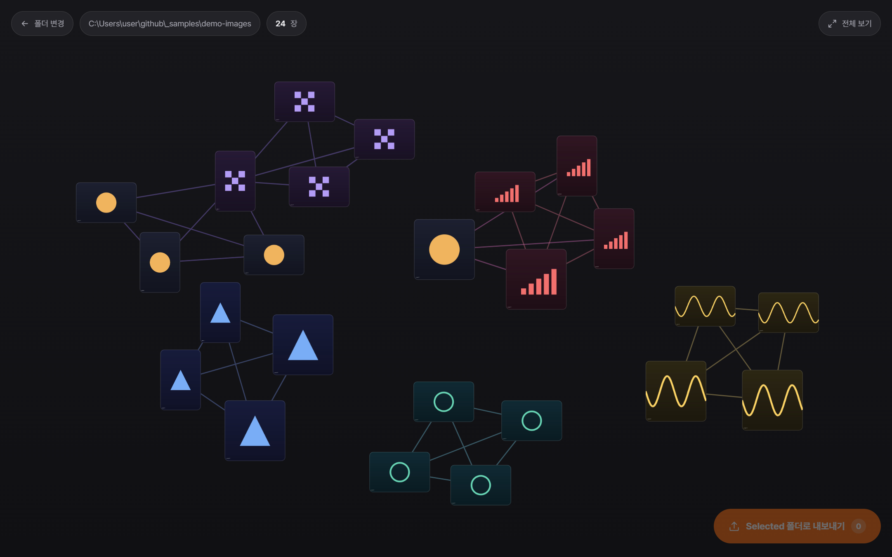
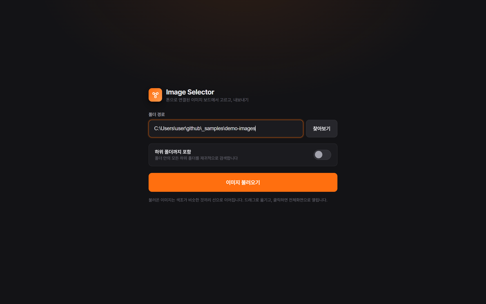

# Image Selector

수백 장의 이미지 중 필요한 것만 골라내는 로컬 이미지 셀렉터입니다.
색조가 비슷한 이미지가 선으로 연결된 보드에서 이미지를 확인하고, 선택한 이미지만 `Selected` 폴더로 복사합니다.

> A local image picker that runs in your browser. Point it at a folder; it lays the images out as a
> board where tone-similar images are linked, you pick what you want full-screen, and it copies the
> picks into a `Selected` folder. Python standard library only — no pip install, no cloud, no
> telemetry. The server binds to 127.0.0.1 and every request is token-checked.

**다운로드** — [v1.0.1 실행 파일](https://github.com/97hhg1114-del/image-selector/releases/latest) (11MB, 파이썬 설치 불필요)



## 어떤 상황에서 쓰나

한 폴더에 이미지가 200~300장 쌓여 있고, 그중 쓸 것 20장을 골라야 할 때 유용합니다.

- **AI 이미지 생성 결과 추리기** — 같은 프롬프트로 뽑은 수백 장 중 톤이 맞는 결과물만 남길 때
- **촬영본·캡처 셀렉** — 비슷한 연속 컷 중 한 장만 고를 때
- **레퍼런스 정리** — 톤이 비슷한 이미지끼리 묶여 보여 무드보드 구성 전 단계로 활용하기 좋습니다

탐색기 썸네일로는 색감 비교가 어렵고, 브릿지나 라이트룸은 카탈로그 생성 과정이 필요합니다.
Image Selector는 폴더 경로만 지정하면 바로 동작합니다.

## 특징

- **톤 기반 보드** — 각 이미지의 색상·채도·명도를 계산해 유사한 이미지끼리 선으로 연결합니다
- **드래그·줌** — 노드를 드래그해 이동하고 마우스 휠로 확대·축소합니다. 클릭하면 전체화면 뷰어가 열립니다
- **즐겨찾기 → 내보내기** — 고른 이미지만 원본 폴더 하위의 `Selected` 폴더로 복사합니다 (원본 유지)
- **의존성 없음** — 파이썬 표준 라이브러리만 사용하므로 `pip install`이 필요하지 않습니다
- 한 폴더 최대 3,000장 지원, 하위 폴더 포함 옵션



## 실행

```bash
python server.py
```

브라우저가 자동으로 열립니다 (`http://127.0.0.1:8777`). 해당 포트가 사용 중이면 다음 빈 포트를 찾아 실행합니다.
윈도우에서는 `run.bat`을 더블클릭해 실행할 수도 있습니다.

폴더 경로를 붙여넣고 **이미지 불러오기**를 누릅니다. 보드에서 이미지를 클릭해 전체화면으로 확인한 뒤 마음에 드는 컷을 즐겨찾기하고, **Selected 폴더로 내보내기**를 누르면 완료됩니다.

## 보안

로컬 전용 도구라도 브라우저를 경유하면 악의적인 웹사이트가 해당 포트로 요청을 보낼 수 있습니다.
따라서 127.0.0.1 바인딩 외에도 다음과 같은 보안 조치를 적용했습니다.

- **요청 토큰** — 실행할 때마다 새 토큰을 만들어 브라우저를 여는 URL(`/?t=…`)에 싣고, 페이지를 포함한 모든 요청에서 검증합니다. 토큰 없는 `GET /`는 403이라, 같은 PC의 다른 프로세스나 다른 계정이 페이지를 읽어 토큰을 얻어 갈 수 없습니다
- **Host / Origin / Sec-Fetch-Site 검사** — 임의 도메인을 127.0.0.1로 연결하는 DNS 리바인딩 공격과 외부 사이트에서 전송된 CSRF 요청을 차단합니다
- **경로 봉인** — 지정한 폴더 외부로는 접근할 수 없습니다. 심볼릭 링크는 `realpath`로 대상을 확인한 뒤 처리합니다
- **이미지만 서빙** — 폴더 내 문서나 스크립트 파일은 제공하지 않으며, 응답 헤더에 `nosniff`를 포함합니다
- **크기 제한과 스트리밍** — JSON 요청 본문은 1MB까지만 받고(초과 시 413), 이미지는 통째로 메모리에 올리지 않고 흘려보냅니다. 요청을 보내다 마는 연결은 30초 뒤 끊습니다

모든 작업은 읽기와 복사로만 이루어지며, 원본 파일을 삭제하거나 덮어쓰지 않습니다.

## exe로 빌드

```bash
build.bat
```

빌드가 완료되면 `dist\ImageSelector.exe`가 생성됩니다. `ui.html`을 수정했다면 다시 빌드해야 합니다
(PyInstaller가 실행 파일 내부에 `ui.html`을 포함합니다).

## 구조

| 파일 | 역할 |
|---|---|
| `server.py` | 로컬 HTTP 서버 — 폴더 스캔, 이미지 서빙, 내보내기 |
| `ui.html` | 화면 전체. 톤 분석·보드 레이아웃·뷰어가 포함되어 있습니다 |
| `make_icon.py` | 빌드용 아이콘 생성 |

## 라이선스

MIT
